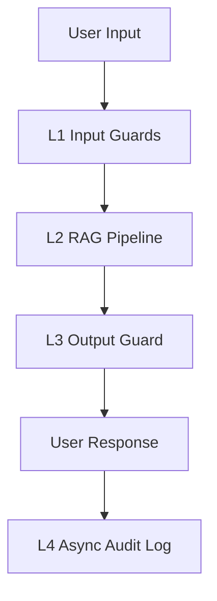

# Production Blueprint

## Section 1: SLO Definition

| Metric | Target | Alert Threshold | Severity |
|---|---|---|---|
| Faithfulness | >= 0.85 | < 0.80 for 30 min | P2 |
| Answer Relevancy | >= 0.80 | < 0.75 for 30 min | P2 |
| Context Precision | >= 0.70 | < 0.65 for 1h | P3 |
| Context Recall | >= 0.75 | < 0.70 for 1h | P3 |
| P95 Latency | < 2.5s | > 3s for 5 min | P1 |

## Section 2: Architecture Diagram

## Section 3: Alert Playbook

### Incident: Faithfulness drops below 0.80
- Severity: P2
- Detection: Continuous eval alert
- Likely causes:
  - Retriever returns weak chunks
  - Prompt drift/regression
- Resolution:
  - Re-index corpus
  - Roll back prompt version

## Section 4: Cost Analysis

| Component | Monthly Cost (estimate) |
|---|---:|
| RAG generation | TBD |
| Continuous eval | TBD |
| Guardrails | TBD |
| Total | TBD |

