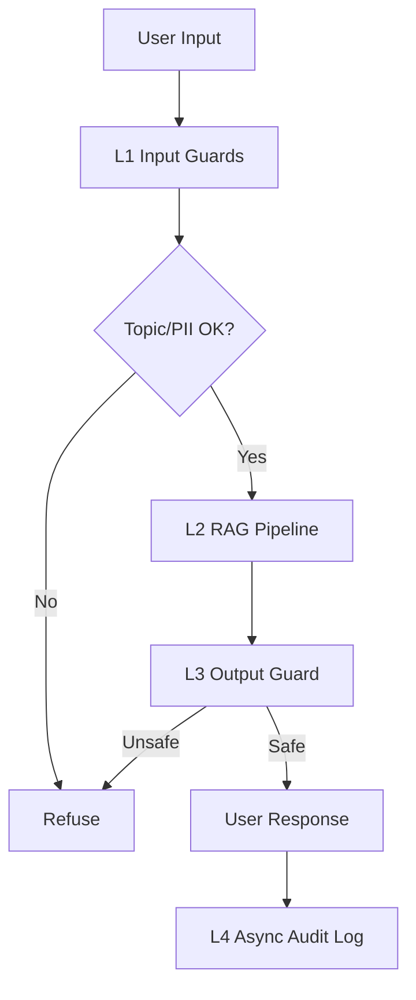

# Production Blueprint

## Section 1: SLO Definition

| Metric | Target | Alert Threshold | Severity |
|---|---|---|---|
| Faithfulness | >= 0.85 | < 0.80 for 30 min | P2 |
| Answer Relevancy | >= 0.80 | < 0.75 for 30 min | P2 |
| Context Precision | >= 0.70 | < 0.65 for 1h | P3 |
| Context Recall | >= 0.75 | < 0.70 for 1h | P3 |
| P95 Latency (total) | < 2.5s | > 3s for 5 min | P1 |
| Guardrail Detection Rate | >= 90% | < 85% | P2 |
| False Positive Rate | < 5% | > 10% | P2 |

## Section 2: Architecture Diagram

### Layer Latency (from phase-c/latency_benchmark.csv)
- L1 P95: 0.66 ms
- L2 P95: 23574.46 ms
- L3 P95: 1.03 ms
- Total P95: 23575.21 ms

Observation: bottleneck is L2 (generation and retrieval stack), while guardrail overhead (L1 + L3) is very low.

## Section 3: Alert Playbook

### Incident 1: Faithfulness drops below 0.80
- Severity: P2
- Detection: Continuous eval alert
- Likely causes:
  - Retriever returns irrelevant chunks
  - Generation prompt drift
  - Corpus update without re-index
- Investigation steps:
  1. Check context_precision and context_recall in same window.
  2. Diff prompt version against last known-good run.
  3. Verify latest indexing job and corpus checksum.
- Resolution:
  - Re-index vector collection
  - Roll back prompt template
  - Increase rerank top-k and re-evaluate

### Incident 2: P95 latency above 3s for 5 minutes
- Severity: P1
- Detection: Latency monitor
- Likely causes:
  - Upstream LLM latency spike
  - Network degradation
  - Model cold start / heavy reranker load
- Investigation steps:
  1. Split latency by L1/L2/L3.
  2. Check LLM provider status and rate-limit logs.
  3. Check cache hit ratio and request concurrency.
- Resolution:
  - Switch to fallback faster model for L2
  - Reduce response max tokens
  - Apply queue/backpressure and retry policy

### Incident 3: Guardrail detection rate below 85%
- Severity: P2
- Detection: Weekly adversarial regression
- Likely causes:
  - New attack patterns not covered by rules
  - Weak keyword-based output guard
- Investigation steps:
  1. Review false negatives in adversarial_test_results.csv.
  2. Cluster misses by attack type.
  3. Compare with previous guardrail release.
- Resolution:
  - Expand input/output policy rules
  - Add stronger moderation model
  - Re-run 20-case adversarial suite before deploy

## Section 4: Cost Analysis

Assumption: 100k queries/month.

| Component | Unit Cost | Volume | Monthly Cost |
|---|---:|---:|---:|
| L2 generation (gpt-4o-mini) | $0.001 / query | 100,000 | $100 |
| Continuous eval (1% sample) | $0.01 / eval query | 1,000 | $10 |
| Pairwise + absolute judge | $0.002 / judged query | 10,000 | $20 |
| Qdrant local (self-hosted) | fixed infra | 1 | $0 (excluded) |
| **Total (estimated)** |  |  | **$130** |

### Cost Optimization Opportunities
- Cache repeated question embeddings and answers for high-frequency queries.
- Lower eval sampling rate during stable periods.
- Use two-tier judging: cheap model default, expensive model only for tie/low-confidence cases.
